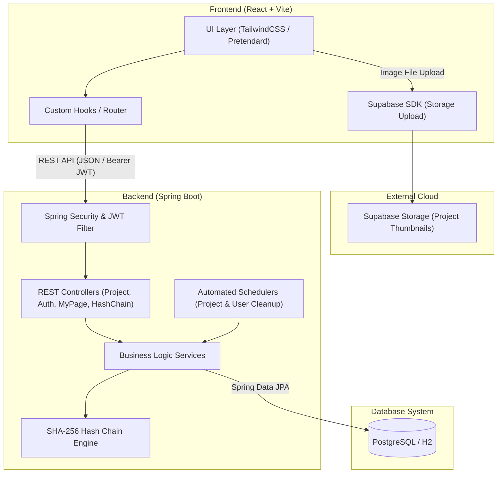
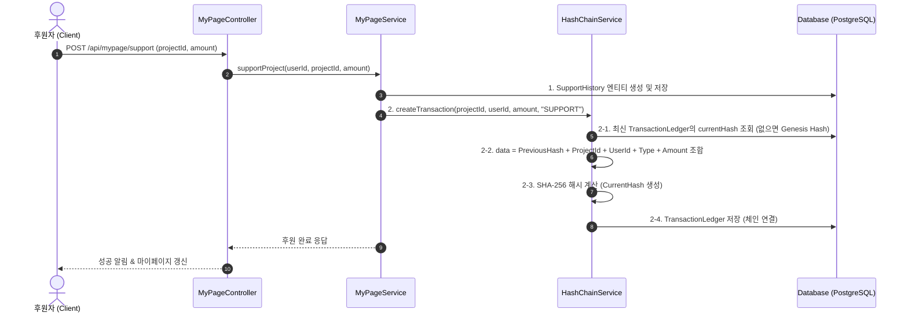
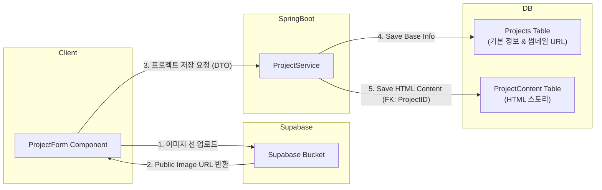

# 🚀 FundChain - 투명한 해시체인 기반 크라우드 펀딩 플랫폼

> **FundChain**은 블록체인 해시 체이닝(Hash Chain) 기술을 응용하여 크라우드 펀딩 후원 내역의 위·변조를 방지하고, 창작자와 후원자 간의 신뢰성 높은 거래 환경을 제공하는 **React + Spring Boot** 기반 웹 애플리케이션입니다.

---

## 📑 목차
1. [프로젝트 개요](#1-프로젝트-개요)
2. [기술 스택 & 아키텍처](#2-기술-스택--아키텍처)
3. [DB & 프로젝트 간 상호작용 (Data Interaction Flow)](#3-db--프로젝트-간-상호작용-data-interaction-flow)
4. [ERD (Entity Relationship Diagram)](#4-erd-entity-relationship-diagram)
5. [핵심 기능 소개](#5-핵심-기능-소개)

---

## 1. 프로젝트 개요

- **프로젝트명**: FundChain (펀드체인)
- **목적**: 기존 크라우드 펀딩 플랫폼의 후원금 집계 및 정산 투명성 문제를 해결하고, 창작자와 후원자를 연결하는 안전하고 직관적인 크라우드 펀딩 서비스 제공
- **핵심 가치**:
  - 🛡️ **투명성 (Transparency)**: SHA-256 기반 해시 체인을 통해 모든 후원/정산 거래 장부의 위변조 방지
  - ⚡ **직관성 (Usability)**: Pretendard 폰트 기반 디자인 시스템과 미려하고 현대적인 UI/UX
  - 🔄 **자동화 (Automation)**: Spring Scheduler를 통한 펀딩 상태(준비/진행/성공/실패) 자동 전환 및 데이터 정제

---

## 2. 기술 스택 & 아키텍처

### 🛠️ Technology Stack

| 분류 | 기술 스택 |
| :--- | :--- |
| **Frontend** | React (Vite), JavaScript (ES6+), TailwindCSS, React Router DOM |
| **Backend** | Java 17, Spring Boot 3.x, Spring Data JPA, Spring Security, JWT |
| **Database** | PostgreSQL / H2 Database |
| **Storage & Tools** | Supabase Storage (이미지 업로드), Swagger / OpenAPI, Gradle |

<br/>

### 📐 전체 시스템 아키텍처 (System Architecture)



---

## 3. DB & 프로젝트 간 상호작용 (Data Interaction Flow)

FundChain의 핵심 비즈니스 로직은 **Spring Boot 백엔드, 데이터베이스(JPA), 그리고 SHA-256 해시 체인** 간의 체계적인 상호작용으로 작동합니다.

### 3.1 💰 후원 및 해시 체인 무결성 장부 상호작용 Flow

후원이 발생하면 단순 DB 저장에 그치지 않고 이전 해시값과 결합하여 **블록체인 형태의 불변 장부**를 생성합니다.



> [!IMPORTANT]
> **해시 체인 무결성 검증 (`verifyChain`)**:
> `HashChainService`는 전체 거래 장부를 ID 순서대로 순회하며 **(1) 데이터 재해시 일치 여부** 및 **(2) 이전 블록의 currentHash와 현재 블록의 previousHash 링크 연결 여부**를 사전에 검증하여 단 1byte의 데이터 변조도 즉시 감지합니다.

<br/>

### 3.2 📁 프로젝트 등록/수정 및 1:1 본문 분리 상호작용

대용량 HTML 스토리를 효율적으로 관리하기 위해 `Projects` 기본 정보 테이블과 `ProjectContent` 상세 본문 테이블을 **1:1 외래키(Cascading)** 관계 구조로 상호작용시킵니다.



<br/>

### 3.3 ⏰ 자동화 스케줄러(Scheduler)와 DB 상호작용

1. **`ProjectScheduler`**:
   - 매 주기마다 `START_DATE` 및 `END_DATE`를 DB 기준 시각과 비교
   - `PREPARING` → `ONGOING` (펀딩 시작)
   - `ONGOING` → 목표 금액 달성 시 `SUCCESS` / 미달 시 `FAILED` (펀딩 종료)로 **상태(STATUS) 자동 갱신**
2. **`UserCleanupScheduler`**:
   - 회원 탈퇴 요청 시 `IS_DELETED = true`, `DELETED_AT = Timestamp`로 **Soft Delete** 처리
   - 일정 기간이 지난 탈퇴 회원을 DB에서 배치 삭제하여 **개인정보 보호 및 DB 용량 최적화**

---

## 4. ERD (Entity Relationship Diagram)

FundChain 데이터베이스의 주요 엔티티와 관계 명세입니다.

```mermaid
erDiagram
    Users ||--o{ Projects : "creates (1:N)"
    Users ||--o{ SupportHistory : "supports (1:N)"
    Users ||--o{ TransactionLedger : "records (1:N)"
    Projects ||--|| ProjectContent : "contains (1:1 CASCADE)"
    Projects ||--o{ SupportHistory : "receives (1:N)"
    Projects ||--o{ TransactionLedger : "logs (1:N)"

    Users {
        VARCHAR_50 USER_ID PK "사용자 아이디"
        VARCHAR_20 USER_ROLE "권한 (USER, CREATOR, ADMIN)"
        VARCHAR_100 PASSWORD "암호화 비밀번호"
        VARCHAR_50 NICKNAME UK "닉네임"
        VARCHAR_50 USERNAME "실명"
        DATE BIRTHDATE "생년월일"
        VARCHAR_20 PHONE_NUM UK "전화번호"
        VARCHAR_100 EMAIL UK "이메일"
        VARCHAR_30 BANK_NAME "정산 은행"
        VARCHAR_25 ACCOUNT_NUM "정산 계좌"
        VARCHAR_512 PROFILE_IMAGE "프로필 이미지 URL"
        BOOLEAN IS_DELETED "탈퇴 여부 (Soft Delete)"
        TIMESTAMP DELETED_AT "탈퇴 시각"
    }

    Projects {
        BIGSERIAL PROJECT_ID PK "프로젝트 식별자"
        VARCHAR_50 CREATOR_ID FK "개설자 아이디 (Users.USER_ID)"
        VARCHAR_255 TITLE "프로젝트 제목"
        VARCHAR_512 THUMBNAIL_IMAGE "대표 이미지 URL"
        NUMERIC_15_2 TARGET_AMOUNT "목표 펀딩 금액 (>0)"
        TIMESTAMP START_DATE "펀딩 시작 일시"
        TIMESTAMP END_DATE "펀딩 마감 일시"
        VARCHAR_20 STATUS "진행 상태 (PREPARING, ONGOING, SUCCESS, FAILED)"
    }

    ProjectContent {
        BIGINT PROJECT_ID PK_FK "프로젝트 식별자 (Projects.PROJECT_ID)"
        TEXT CONTENT_HTML "상세 설명 스토리 (HTML)"
    }

    SupportHistory {
        BIGSERIAL SUPPORT_ID PK "후원 내역 식별자"
        BIGINT PROJECT_ID FK "프로젝트 식별자"
        VARCHAR_50 USER_ID FK "후원자 아이디"
        NUMERIC_15_2 AMOUNT "후원 금액 (>0)"
        TIMESTAMP SUPPORTED_AT "후원 일시"
    }

    TransactionLedger {
        BIGSERIAL LEDGER_ID PK "해시 장부 식별자"
        BIGINT PROJECT_ID FK "프로젝트 식별자"
        VARCHAR_50 USER_ID FK "거래 관련 사용자 아이디"
        VARCHAR_20 TRANSACTION_TYPE "거래 유형 (SUPPORT, SETTLEMENT, REFUND)"
        NUMERIC_15_2 AMOUNT "거래 금액"
        VARCHAR_64 PREVIOUS_HASH "이전 블록 SHA-256 해시"
        VARCHAR_64 CURRENT_HASH "현재 블록 SHA-256 해시"
        TIMESTAMP CREATED_AT "장부 기록 일시"
    }
```

---

## 5. 핵심 기능 소개

### 1. 🔐 회원가입 및 JWT 기반 보안 인증
- 일반 사용자 / 크리에이터 / 관리자 권한 분리 (`USER_ROLE`)
- SHA-256 패스워드 암호화 및 JWT 토큰 기반 인증 체계
- 안전한 탈퇴 처리를 위한 Soft Delete 스케줄링

### 2. 🎨 프로젝트 탐색 및 상세 조회
- 펀딩 진행 상태별 프로젝트 필터링 및 메타 정보 카드
- HTML 상세 스토리 렌더링 및 펀딩 달성률(%) 계산 모듈

### 3. 📝 프로젝트 등록 및 수정 (크리에이터 기능)
- Supabase Storage 지연 업로드 기반 이미지 등록/미리보기
- 프로젝트 제목, 썸네일, 목표 금액, 시작/마감 일시, 상세 스토리 등록 및 수정 UI

### 4. 💸 펀딩 참여 (후원) 시스템
- 원하는 금액 후원하기 및 마이페이지 실시간 후원 내역 반응
- 후원 즉시 **SupportHistory** 기록 및 **TransactionLedger** 해시 체이닝 블록 연동

### 5. 🔗 해시 체인 검증 및 투명성 대시보드
- 모든 거래 내역에 대해 SHA-256 이전 해시 링킹 적용
- 무결성 검증 API (`/api/hashchain/verify`)를 통해 변조 여부 실시간 확인

---

### 📬 개발 정보
- **플랫폼**: FundChain
- **프론트엔드**: React + Vite + TailwindCSS
- **백엔드**: Spring Boot + Spring Data JPA + H2/PostgreSQL
